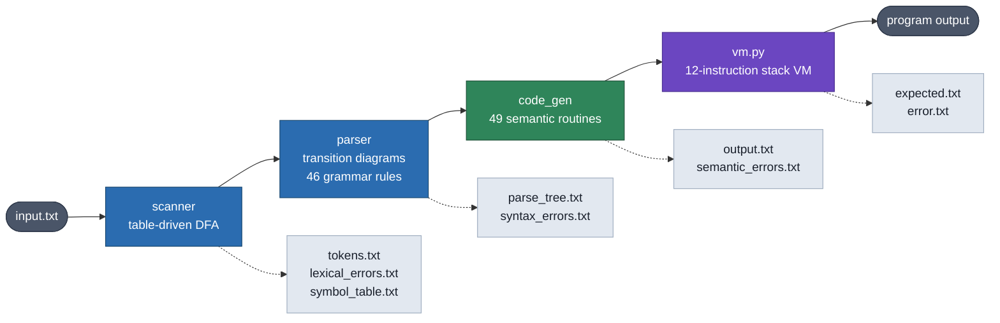
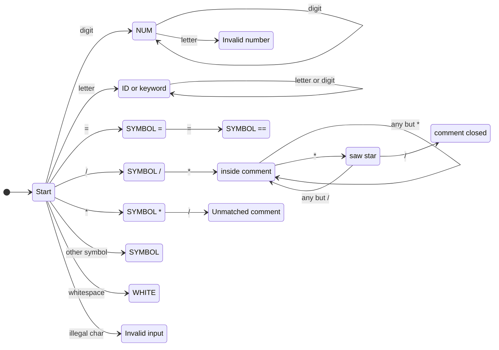

# mini-c-compiler


A compiler for a C-like teaching language, written from scratch in Python with
no parser generator and no external parsing library. It takes a source program
all the way from raw characters to intermediate code, then runs that code on a
bundled stack VM.

Written by [Yashar Paymai](https://github.com/yasharp83) and
[Pourya Erfanzadeh](https://github.com/erfnzdeh) for Compiler Design (40414) at
Sharif University of Technology, spring 2025, under Dr. Samane Hosseinmardi.

## The pipeline




The three phases are roughly 450, 390 and 450 lines respectively.

What makes this a from-scratch build rather than a wiring exercise: the parser
is driven by transition diagrams constructed at startup from a plain-text
grammar plus its FIRST and FOLLOW sets (`parser/grammar_config/`), and the code
generator hangs off that same grammar — the `#push_type`, `#scope_start`,
`#backpatch_jump` markers you can see interleaved with the productions *are*
the semantic actions, fired as the parser walks each rule. Adding a language
construct means editing the grammar file, not the parser.

## Inside the scanner

Phase one is a single DFA covering every token class at once, built in
`scanner/init_dfa.py`. Longest-match falls out of the structure: the machine
keeps consuming while an edge exists, and the token is emitted when it reaches a
state with nowhere left to go. The `/` and `*` branches are where it gets
interesting — one character of lookahead decides between an operator, a comment,
and an error.



Keywords are not separate states. Everything alphabetic lands in `ID`, and
`get_next_token` re-labels the lexeme as `KEYWORD` afterwards if
`is_keyword` matches one of the seven reserved words — which is why adding a
keyword touches the list in `alphabet_config.py` and nothing in the machine.

## The language

A C subset: `int` and `void`, one-dimensional arrays, functions with recursion,
`if`/`else`, `while` with `break`, and `return`. Seven keywords — `if`, `else`,
`void`, `int`, `while`, `break`, `return` — plus an `output()` builtin.

```c
int fib(int n) {
    int f;
    if (n < 2) {
        f = 1;
    } else {
        f = fib(n - 1) + fib(n - 2);
    }
    return f;
}

void main(void) {
    output(fib(3));
}
```

The VM has 12 instructions: `ADD` `SUB` `MULT` `DIV` `EQ` `LT` `AND` `NOT`
`ASSIGN` `JP` `JPF` `PRINT`.

## Diagnostics

Errors are reported per phase with a line number, not collapsed into a single
"syntax error". The semantic pass catches undefined identifiers, type mismatch
in operands, `void` used as a value, wrong argument count, wrong argument type,
and `break` outside a loop:

```
#14 : Semantic Error! 'b' is not defined.
#16 : Semantic Error! Mismatch in type of argument 1 of 'abs'. Expected 'int' but got 'array' instead.
#17 : Semantic Error! Mismatch in numbers of arguments of 'abs'.
#34 : Semantic Error! No 'while' found for 'break'.
```

## Quick start

```bash
pip install -r requirements.txt
```

Python 3.10 or newer is required. Not for any modern syntax — the code is
plain — but because the `parser/` package collides with the `parser` module
that CPython shipped as a *built-in* through 3.9. Built-in modules are resolved
ahead of `sys.path`, so on 3.9 `from parser.parser import Parser` finds the
interpreter's own module and fails with `'parser' is not a package`. The
collision disappeared when that module was removed in 3.10.

Compile and run in one shot:

```bash
python3 compile_and_exec.py -i input.txt -o expected.txt -e error.txt
```

All three flags are optional and default to the values shown. To run the phases
separately, `python3 compiler.py` compiles `input.txt`, and `python3 execute.py`
runs the resulting `output.txt`.

## Tests

18 testcases ship with the project — 14 that compile and run, and 4 that are
expected to fail semantic analysis with specific diagnostics.

```bash
./run_tests.sh          # everything
./run_tests.sh T1 S3    # named cases only
```

The runner diffs VM output against each case's `expected.txt` and diagnostics
against its `semantic_errors.txt`, and exits non-zero on any failure. CI runs
the same script on Python 3.10, 3.11 and 3.13.

## Layout

| Path | What's in it |
|------|--------------|
| `scanner/` | DFA construction, buffered reader, symbol table, token and lexical-error output |
| `parser/` | Transition-diagram parser, grammar/FIRST/FOLLOW config, syntax error recovery |
| `code_gen/` | Semantic routines, scope frames, three-address code emission |
| `compiler.py` | Wires the three phases together |
| `compile_and_exec.py` | CLI: compile, then execute |
| `execute.py` | Runs generated code on the VM |
| `Tests/` | Testcases and the VM |

Each of `scanner/`, `parser/` and `code_gen/` has its own README covering that
phase in more detail.
